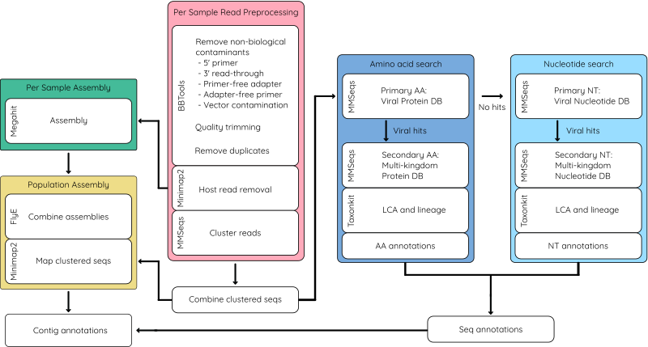

The pipeline consists of three main sections: Read preprocessing, Virus identification, and Assembly.

## Preprocessing

Heactomb is designed to perform rigorous quality control prior to assembly and taxonomic assignment. 
This rigor is justified primarily by the philosophy of [Garbage In, Garbage out](https://en.wikipedia.org/wiki/Garbage_in,_garbage_out). 
More specifically, the following issues are dealt with to ensure that only non-contaminat biological sequence is used for downstream analysis.

1. Non-biological sequence removal (primers, adapters)
2. Host sequence removal
3. Removal of redundant sequences (clustering)
	- Creation of sequence count table
	- Calculation of sequence properties (e.g. GC content, tetramer frequencies)

Hecatomb comes with a number of host genomes for use with this preprocessing, and bespoke host genomes can be added by the user.

## Virus identification

Hecatomb uses mmseqs2 to assign taxonomy to individual sequences. 
It does so through an iterative search approach, which is a large part of the heart of hecatomb.

The first search takes all query seqeunces (the seqtable from the preprocessing steps) and queries them against a virus protein target database. 
This initial search is a translated (nt-to-aa) search. 
All of the reads assigned a viral taxonomy in this first search need to be confirmed to be truly viral in origin. 
The issue here is that querying a target database consisting solely of viral proteins does not permit each sequence to see if it really originates from a different domain of life. 
So while a sequence may be classified as viral at this stage, once queried against a more comprehensive sequence database 
(consisting of bacteria, plants, vertebrates, fungi, etc.) those sequences may have higher statistically similar sequences in those domains of life.

It is formally possible to just do this secondary search, skipping the first step querying each sequence against a virus-only protien databse. 
However, this can be computationally very expensive. 
For example, if you have 1e6 reads as your query input (sequences in your seqtable) and you query these against the 
virus-only protien database with 1.8e6 entries that is over 25 orders of magnitude smaller than UniRef50 which has 49,410,134 entries when this was written. 
The primary search against a virus-only database serves as a 'net' to (relatively) quickly capture sequences of interest. 
In our experience, however, the secondary search against the larger database is still required as many of the sequences 
assigned a viral taxonomy when only querying the smaller virus-only sequence database will reveal themselves to be entirely something else upon this secondary search. 
Thus, the iterative approach will expedite sample processing by capturing only a small portion of the input sequences as 'potentially' viral and confirming them in the secondary search as 'likely' viral.

This process wherein a sequence is classified as viral in the first search against a virus-only database and then no 
longer classfied as viral after the second search against a more comprehensive database is where hecatomb gets it's namesake. 
Many investigators, particularly those lacking access to large computing infrastructure will rely on the results of the 
primary search which, due to the relatively small target database size, can be done on commodity hardware. 
Examining the results at this stage will regularly identify a large number of viruses. 
Basically anything with any level of sequence identity to a viral protein will be called viral even if the sequence 
originated from a bacteria, plant, fungi or other organism. 
These sequences are 'sacrificed' through the secondary search when many of the viral calls from the first search are lost.

## Assembly

The preprocessing rule also goes ahead and does assembly as contigs are an important prerequisite for many downstream analysis.
The assembly strategy consists of several steps intended to be resource efficient and to maximise representation of all present species.
First, individual [MEGAHIT](https://github.com/voutcn/megahit) assemblies are produced for each sample.
The reads are then mapped to the combined assemblies and any unmapped reads undergo another round of assembly.
All contigs are then combined and merged into a non-redundant set of contigs with [Flye](https://github.com/fenderglass/Flye).

The assembly contigs are directly annotated with MMSeqs.
The assembly is also subject to a pseudo consensus annotation approach whereby the SeqTable sequences are mapped and their
Taxonomic assignments in the BigTable are combined with the read mapping information.
We find this useful with investigating the origins of contigs of interest.

## Snakemake

The Hecatomb pipeline is powered by [Snakemake](https://snakemake.readthedocs.io/).
It comes preconfigured and includes a launcher script to make running the pipeline simple.
We chose to use Snakemake over other workflow managers largely because of our extensive experience with it.
Snakemake does a lot of heavy lifting to make our lives easier, and the pipeline better.
It manages all the pipeline jobs, as well as generates benchmarks and reports for everything, allows the pipeline to 
be naturally reentrant, parallel, portable, robust, containerised, and many other buzzwords!

