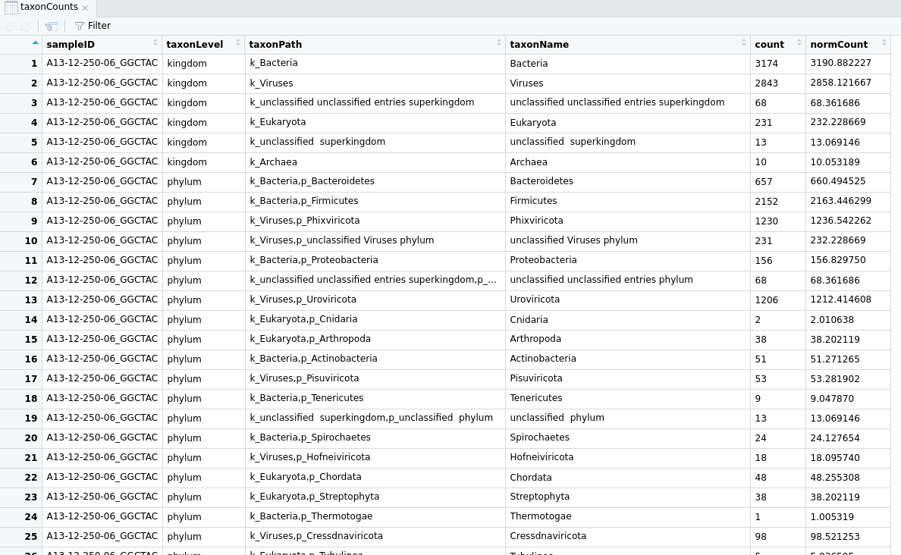
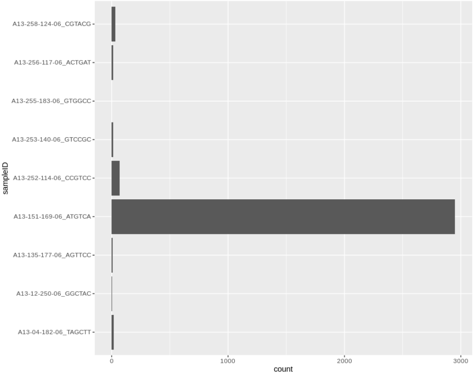
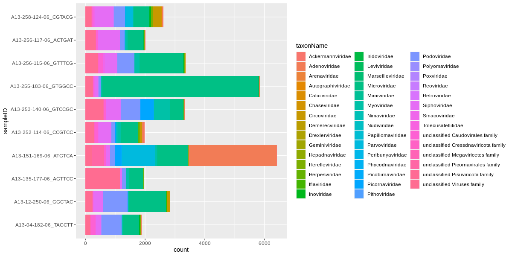

## Preliminary taxon count plots

The `taxonLevelCounts.tsv` file is intended to make it quick and easy to compare virus hit counts across samples.
Let's take a look at it:

[](img/taxCountTable.png)

The file contains the counts and normalised counts for each taxonomic level, for each sample, 
based on the raw (unfiltered) hit counts.
If we wanted to compare the number of Adenoviridae hits between each sample we could pull out the Adenoviridae counts and plot them:

```R
# get adenoviridae counts
adenoCounts = taxonCounts %>% filter(taxonLevel=='family',taxonName=='Adenoviridae')

# plot
ggplot(adenoCounts) +
    geom_bar(aes(x=sampleID,y=count),stat='identity') +
    coord_flip()
```

[](img/tuteAdenoBar.png)

We can take this one step further and plot all the viral family normalised counts for each sample, in a stacked bar chart:

```R
# get all viral family counts
viralCounts = taxonCounts %>% filter(taxonLevel=='family', grepl('k_Viruses',taxonPath))

# plot
ggplot(viralCounts) +
    geom_bar(aes(x=sampleID,y=count,fill=taxonName),position = 'stack',stat='identity') +
    coord_flip()
```

[](img/tuteViralCounts.png)

