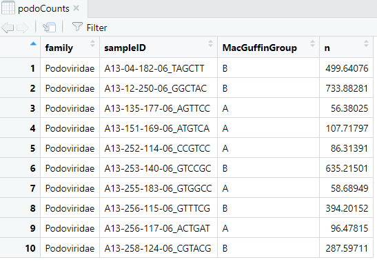
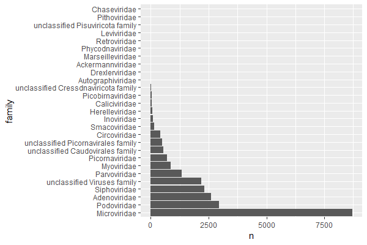

This section assumes you have completed [Tutorial Part3](tutorialPt3.md).

# Compare viral loads

In part 3, we compared the viral counts between the two sample groups for _Podoviridae_,
and it appeared as though group B had more viral sequence hits on average than group A.
We can compare the normalised counts for these two groups to see if they're significantly different.

**Student's T-test**

Let's check out the dataframe we made earlier that we'll be using for the test:

```R
View(podoCounts)
```



We'll use the base-r function `t.test()`, which takes two vectors--one with the 
group A counts and one with the group B counts.
We can use the `filter()` and `pull()` functions within the `t.test()` function like so:

```R
t.test(
    podoCounts %>% filter(MacGuffinGroup=='A') %>% pull(n),
    podoCounts %>% filter(MacGuffinGroup=='B') %>% pull(n),
    alternative='two.sided',
    paired=F,
    var.equal=T)    
```

```text
	Two Sample t-test

data:  podoCounts %>% filter(MacGuffinGroup == "A") %>% pull(n) and podoCounts %>% filter(MacGuffinGroup == "B") %>% pull(n)
t = -5.3033, df = 8, p-value = 0.0007255
alternative hypothesis: true difference in means is not equal to 0
95 percent confidence interval:
 -615.5267 -242.4563
sample estimates:
mean of x mean of y 
 81.11595 510.10744 
```

**Wilcoxon test**

You might prefer to perform a Wilcoxon test; the syntax is very similar to the t.test:

```R
wilcox.test(
    podoCounts %>% filter(MacGuffinGroup=='A') %>% pull(n),
    podoCounts %>% filter(MacGuffinGroup=='B') %>% pull(n),
    alternative='t',
    paired=F)
```

```text
	Wilcoxon rank sum exact test

data:  podoCounts %>% filter(MacGuffinGroup == "A") %>% pull(n) and podoCounts %>% filter(MacGuffinGroup == "B") %>% pull(n)
W = 0, p-value = 0.007937
alternative hypothesis: true location shift is not equal to 0
```

**Dunn's test**

Let's use Dunn's test to check all the major families at the same time.
First find out what the major families are by summing the hits for each family and sorting the table.

```R
# collect the family counts
viralFamCounts = virusesFiltered %>% 
    group_by(family) %>% 
    summarise(n=sum(normCount)) %>% 
    arrange(desc(n))

# update factor levels to the sorted order
viralFamCounts$family = factor(viralFamCounts$family, levels = viralFamCounts$family)
```

and plot:

```R
ggplot(viralFamCounts) +
    geom_bar(aes(x=family,y=n),stat='identity') +
    coord_flip()
```



Let's focus on _Siphoviridae_, _Adenoviridae_, _Podoviridae_, and _Microviridae_.
Collect summary counts for these families for each sample and include the metadata we want to use:

```R
viralMajorFamCounts = viruses %>% 
    filter(family %in% c('Siphoviridae','Adenoviridae','Podoviridae','Microviridae')) %>% 
    group_by(sampleID,family,MacGuffinGroup) %>% 
    summarise(n=sum(normCount))
```

Now let's do the dunn's test for these families:

```R
viralMajorFamCounts %>% 
    group_by(family) %>% 
    dunn_test(n ~ MacGuffinGroup,p.adjust.method='holm') %>% 
    add_significance()
```

```text
# A tibble: 4 x 10
  family       .y.   group1 group2    n1    n2 statistic       p   p.adj p.adj.signif
* <chr>        <chr> <chr>  <chr>  <int> <int>     <dbl>   <dbl>   <dbl> <chr>       
1 Adenoviridae n     A      B          5     4     0     1       1       ns          
2 Microviridae n     A      B          5     5     0.522 0.602   0.602   ns          
3 Podoviridae  n     A      B          5     5     2.61  0.00902 0.00902 **          
4 Siphoviridae n     A      B          5     5     0.940 0.347   0.347   ns 
```

It seems like only _Podoviridae_ is significantly different.

# Compare presence/absence

